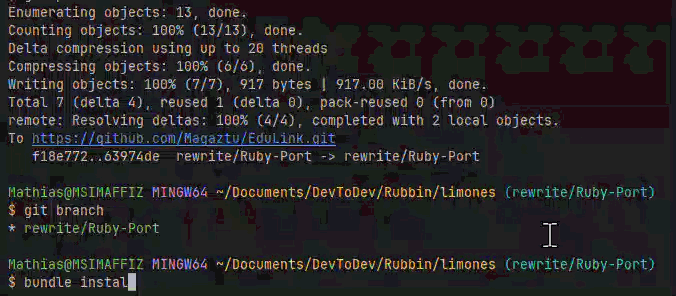
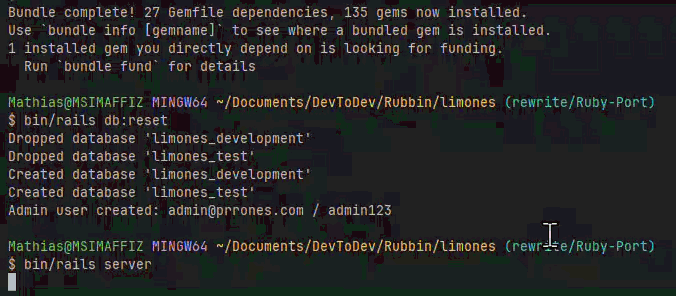
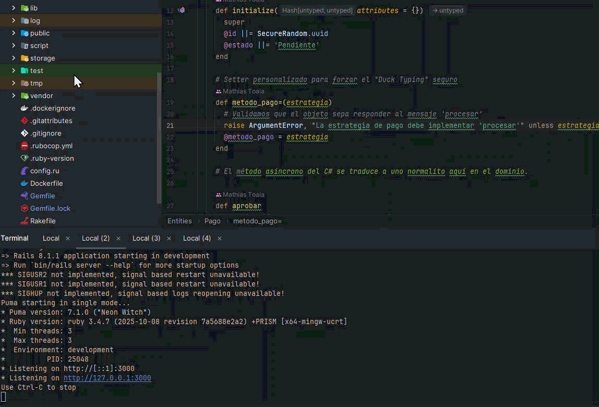
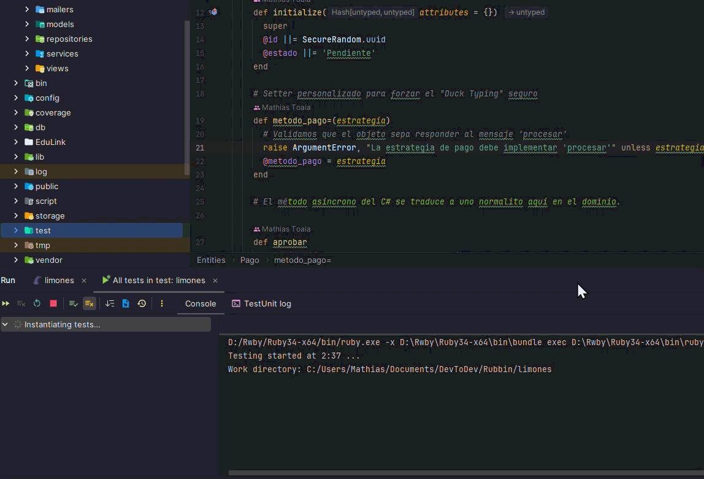
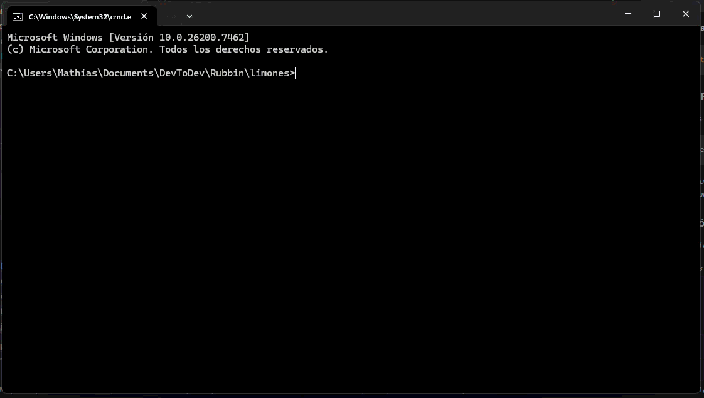

# EduLink – Plataforma de Gestión de Servicios Educativos

## _¿Qué es EduLink?_

EduLink es una plataforma web desarrollada en **Ruby on Rails 8** diseñada para conectar a proveedores de servicios educativos (tutores, profesores, instructores) con estudiantes (clientes). El sistema permite a los proveedores publicar servicios, gestionar horarios y disponibilidad, mientras que los clientes pueden explorar, reservar y pagar por estos servicios de manera eficiente.

El sistema incluye funcionalidades clave como:
*   Gestión de usuarios con roles diferenciados (Cliente y Proveedor).
*   Publicación de servicios con imágenes y políticas de cancelación configurables.
*   Sistema de reservas basado en slots de tiempo (horarios).
*   Procesamiento de pagos simulado con diferentes estrategias.
*   Panel de administración para la gestión de datos.
*   Manejo de estados para reservas y horarios.

---

## Instrucciones de Ejecución

Para levantar el entorno de desarrollo local:

1.  **Prerrequisitos:** Deben tener instalado Ruby 3.4+ y las gemas base.
2.  **Instalación de dependencias:**
    ```bash
    bundle install
    ```
3.  **Configuración de la base de datos:**
    ```bash
    bin/rails db:reset
    ```
    *(Este comando crea la base de datos, ejecuta las migraciones y carga los datos semilla, incluyendo el usuario administrador).*


4.  **Iniciar el servidor:**
    ```bash
    bin/rails server
    ```
5.  **Acceso:** La plataforma se despliega en `http://localhost:3000`.

### Demostración de Ejecución
*Primera parte:*

*Segunda parte:*


---

## Instrucciones para Ejecutar Pruebas

El proyecto cuenta con un grupo de pruebas automatizadas (con Minitest y k6) que incluye pruebas unitarias, de integración y de rendimiento.

### Pruebas Unitarias y de Integración (Minitest)
Para ejecutar todas las pruebas unitarias completas:

```bash
bin/rails test
```

Para ejecutar una prueba específica (usar con pruebas de integración):
```bash
bin/rails test test/integration/persistence_test.rb
```

### Pruebas de Rendimiento (k6)
Para ejecutar las pruebas de carga (requiere tener [k6](https://k6.io/) instalado y en PATH):

```bash
k6 run test/performance/basic_load_test.js
```
*Esta prueba simula una carga que escala de usuarios virtuales, los cuales acceden a la página de inicio y al catálogo de servicios, verificando tiempos de respuesta y porcentajes de error.*

### Demostración de Pruebas
*Si tienen el IDE RubyMine...*

_Ejecutar pruebas **unitarias** y **de integración**:_

_Resultados totales:_

_Ejecutar prueba de rendimiento:_

---

## Integrantes del Equipo y Roles

*   **[Xavier Carpio]** - [Backend Developer]
*   **[Sebastián García]** - [Frontend Developer / UI]
*   **[Gabriel Sánchez]** - [Tester de Accesibilidad / UX]
*   **[Mathias Toala]** - [DevOps / Documentation / Despliegue]

---

## _Apéndice:_ Aplicación de Principios SOLID

El diseño del sistema se ha guiado por los principios SOLID para asegurar un código mantenible y extensible. A continuación, se presentan ejemplos concretos de su aplicación en este proyecto:

### 1. Principio de Responsabilidad Única (SRP)
**Ubicación:** `app/domain/entities/slot_horario.rb`

La entidad `SlotHorario` no contiene la compleja lógica condicional para determinar si se puede reservar, cancelar o bloquear. En cambio, esta lógica pasa a clases específicas de estado (`DisponibleState`, `ReservadoState`, etc.).
*   La Entidad solo tiene una razón de cambio.
*   Se evita que la clase `SlotHorario` se convierta en un obejto lleno de sentencias `if/else`.

### 2. Principio de Abierto/Cerrado (OCP)
**Ubicación:** `app/domain/entities/pago.rb`

La entidad `Pago` cambia el método de pago del cliente usando una estrategia (por ejemplo, `tarjeta_pago_strategy`).
*   No es necesario alterar el código fuente de `Pago` para incluir nuevos métodos de pago, está cerrado a modificaciones.
*   Siempre es posible añadir un nuevo método de pago si este hereda de la interfaz correspondiente (`i_pago_strategy`), está abierto a modificaciones.

### 3. Principio de Inversión de Dependencias (DIP)
**Ubicación:** `app/repositories/usuario_repository.rb`

El sistema desacopla el Dominio de la Infraestructura (Base de Datos).
*   Las entidades de dominio (`Entities::Cliente`, `Entities::Proveedor`) son objetos puros de Ruby. No saben que existe una base de datos SQL.
*   En este sentido, `UsuarioRepository` actúa como un **adaptador** que implementa la interfaz que el dominio necesita (`find`, `save`). Es el repositorio quien depende del dominio (para mapear datos a entidades), evitando que el dominio dependa directamente de la base de datos. Esto permite cambiar el ORM o la base de datos sin afectar la lógica de negocio (que de hecho se realizó multiples veces en este proyecto sin necesidad de reescribir **Application** o **Domain**).
